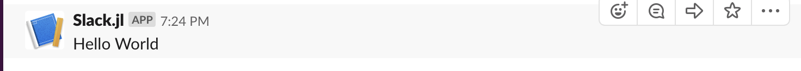
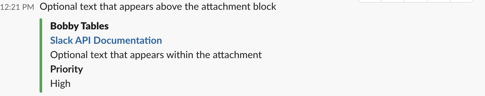

# Slack

[Check out the Docs](https://julialangslack.github.io/Slack.jl/)
## Current State

The only feature that still needs to be actively developed for the [single production project utalizing this code](https://github.com/JuliaLangSlack/StackOverflowBot) is the addition of some functions for threaded messages. Once this is done, unless there is a community requested addition, this code will remain pretty much static. 

Feel free to open an issue or Pull Request with additions or feature requests/bugs. 

## Setup

The first thing you will need to use this package is a [Slack Workspace](https://slack.com/create) to [install a Slack app into](https://api.slack.com/start).

After that, you will need to add a `webhook` to your app such that you can send and retrieve data from the Slack Workspace.

## Install

```julia
julia> ]
(v1.3) pkg> add Slack
```

## Usage

Here is a simple example:

__Note that the endpoint in the example and tests was deprecated automatically by Slack's API Security Crawler.__
```julia
julia> using Slack

julia> endpoint = "/services/TQVJBU534/BR8C1LMPS/42thawJz34SWSgZCpniyLBSE"
"/services/TQVJBU534/BR8C1LMPS/42thawJz34SWSgZCpniyLBSE"

julia> data = "Hello World"
"Hello World"

julia> response = sendtoslack(data, endpoint)
"ok"
```
The result of running this code produces the following in the test Slack Workspace:



To learn more about how data should be formatted before sending it as a argument to the above code, check out the [Slack API Docs](https://api.slack.com/messaging/composing/formatting).

You can also check your messages format using [Slacks Message Formatting Tool](https://api.slack.com/docs/messages/builder?msg=%7B%22text%22%3A%20%22This%20is%20a%20line%20of%20text.%5CnAnd%20this%20is%20another%20one.%22%7D).


And here is a more complicated example using attachments:

```julia
julia> using Slack

julia> endpoint = "/services/TQVJBU534/BR8C1LMPS/42thawJz34SWSgZCpniyLBSE"
"/services/TQVJBU534/BR8C1LMPS/42thawJz34SWSgZCpniyLBSE"

julia> attachment = Dict("attachments" => [Dict("fallback" => "Required plain-text summary of the attachment",
                                               "color" => "#36a64f",
                                               "pretext" => "Optional text that appears above the attachment block",
                                               "author_name" => "Bobby Tables",
                                               "author_link" => "http://flickr.com/bobby/",
                                               "author_icon" => "http://flickr.com/icons/bobby.jpg",
                                               "title" => "Slack API Documentation",
                                               "title_link" => "https://api.slack.com/",
                                               "text" => "Optional text that appears within the attachment",
                                               "fields" => [Dict("title" => "Priority",
                                                   "value" => "High",
                                                   "short" => false
                                                   )]
                                           )])
Dict{String,Array{Dict{String,Any},1}} with 1 entry:
  "attachments" => Dict{String,Any}[Dict("author_link"=>"http://flickr.com/bob"


julia> response = sendattachmenttoslack(attachment, endpoint)
"ok"

```

The result of running this code produces the following in the test Slack Workspace:



